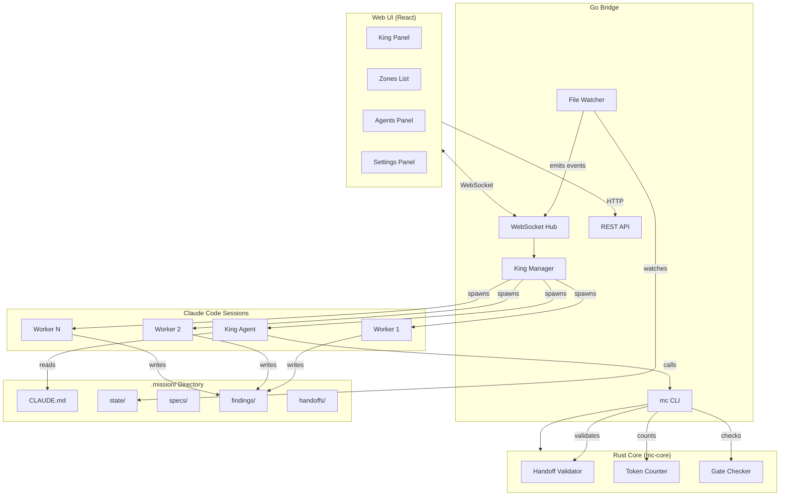
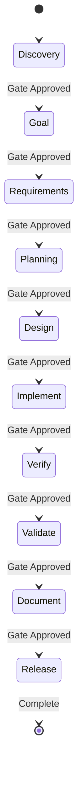
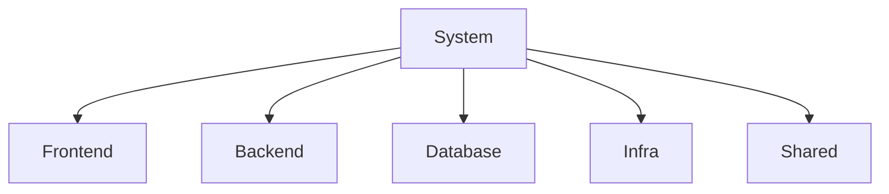
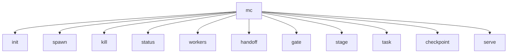
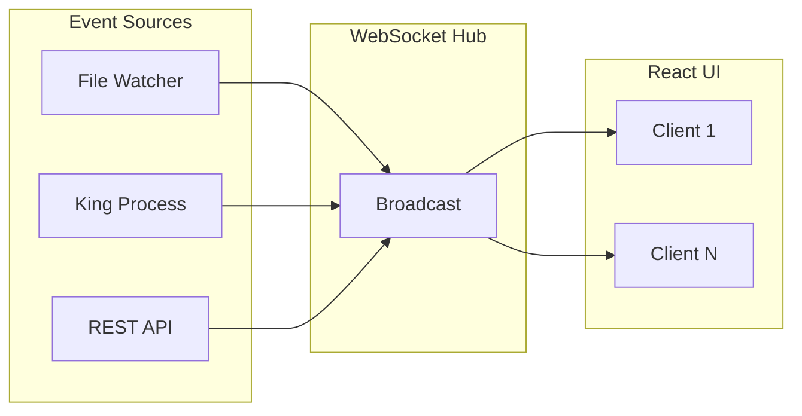
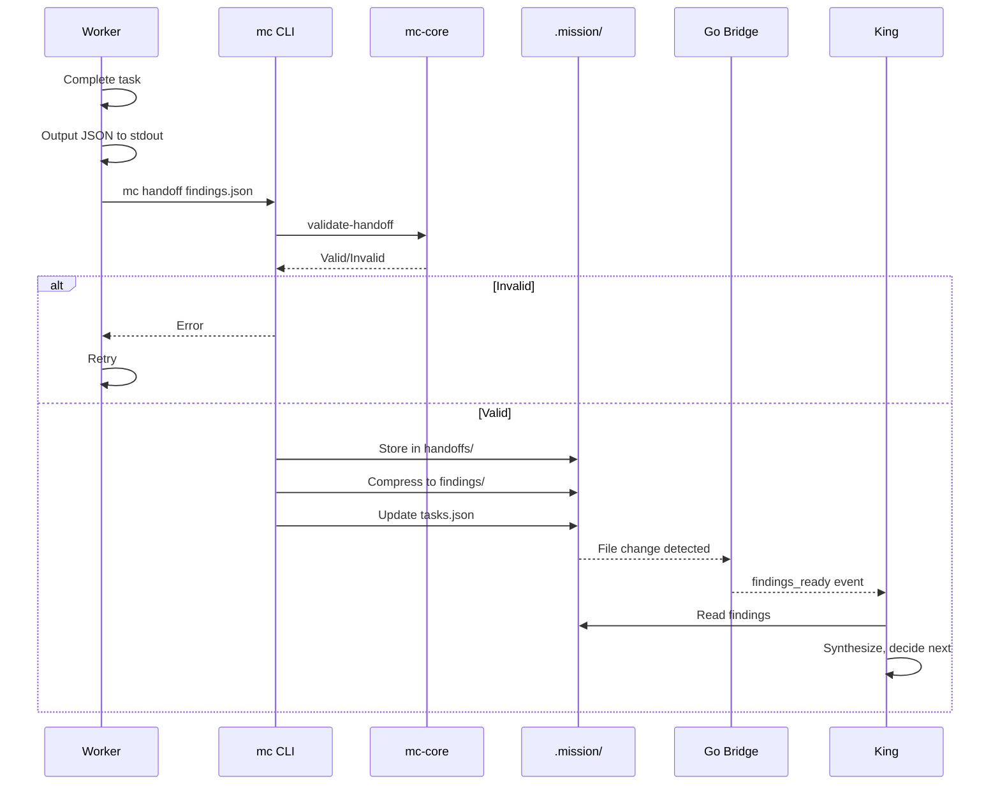
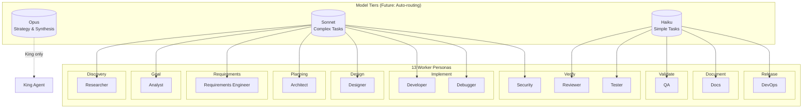
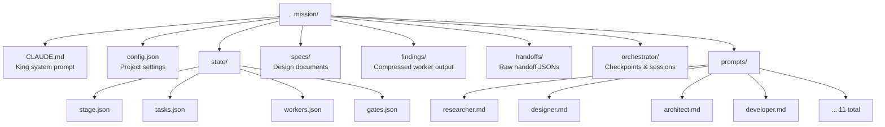

# Architecture

MissionControl is a visual multi-agent orchestration system where a **King** agent coordinates **worker** agents through a **10-stage workflow**.

## System Overview



**Key insight:** King IS a Claude Code session with a good system prompt. Go bridge spawns processes and relays events — no custom LLM API calls. Rust core handles deterministic operations (validation, token counting) that shouldn't consume LLM tokens.

### What We're NOT Building

| Thing | Why Not |
|-------|---------|
| Custom orchestration loop | Claude Code IS the orchestration |
| LLM API integration in Go | King handles all LLM interaction |
| Agent-to-agent message queue | Workers write findings to files |
| Context compilation service | .mission/ files ARE the context |

### How King Orchestrates

King is a Claude Code session with `.mission/CLAUDE.md` as its system prompt. It orchestrates by:
- Using bash to call `mc spawn`, `mc status`, `mc handoff`, `mc gate`
- Reading/writing `.mission/` files directly (specs, findings, state)
- Leveraging normal Claude Code capabilities (file editing, bash, etc.)

## Key Concepts

### King Agent
The King is the only persistent agent. It talks to you, decides what to build, spawns workers, and approves stage gates. It never implements directly.

### Workers
Workers are ephemeral. They receive a **briefing** (~300 tokens), do their task, output **findings**, and die. This keeps context lean and costs low.

### 10-Stage Workflow



Each stage has a **gate** requiring approval before proceeding.

| Stage | Purpose | Workers | Gate Criteria |
|-------|---------|---------|---------------|
| **Discovery** | Research feasibility & prior art | Researcher | Spec drafted, feasibility assessed |
| **Goal** | Define goals & success metrics | Analyst | Goals defined, metrics established |
| **Requirements** | Document requirements & acceptance criteria | Requirements Engineer | Requirements documented, criteria defined |
| **Planning** | API contracts, data models, system design | Architect | Architecture approved, contracts defined |
| **Design** | UI mockups, wireframes, user flows | Designer | Mockups + design artifacts approved |
| **Implement** | Build features | Developer, Debugger | Code complete, builds |
| **Verify** | Code review & quality checks | Reviewer, Security, Tester | All checks pass |
| **Validate** | E2E validation, user acceptance | QA | User flows validated, E2E tests pass |
| **Document** | README + docs | Docs | Docs complete |
| **Release** | Deploy & verify | DevOps | Deployed, verified |

### Zones

Zones organize the codebase (Frontend, Backend, Database, Infra, Shared). Workers are assigned to zones and stay in their lane.



## Directory Structure

```
/
├── cmd/mc/                  # mc CLI
├── orchestrator/            # Go bridge
│   ├── api/
│   │   ├── routes.go        # Route registration
│   │   ├── king.go          # King endpoints
│   │   ├── agents.go        # Agent endpoints
│   │   ├── zones.go         # Zone endpoints
│   │   └── projects.go      # Project/wizard endpoints
│   ├── bridge/
│   │   └── king.go          # King tmux manager
│   ├── core/
│   │   └── client.go        # Rust subprocess wrapper
│   ├── manager/
│   └── ws/
├── core/                    # Rust core
│   ├── workflow/
│   ├── knowledge/
│   ├── ffi/
│   └── README.md
├── web/                     # React UI
├── agents/                  # Python agents (educational)
├── docs/
│   └── archive/             # Historical specs
├── scripts/                 # Dev scripts
├── README.md
├── ARCHITECTURE.md
├── CONTRIBUTING.md
├── CHANGELOG.md
├── TODO.md
└── Makefile
```

## Stack

| Component | Language | Purpose |
|-----------|----------|---------|
| **Agents** | Python | Custom agents, educational |
| **mc CLI** | Go | MissionControl CLI commands |
| **Orchestrator** | Go | Process management, REST, WebSocket |
| **mc-core** | Rust | Validation, token counting, gate checking |
| **Core** | Rust | Workflow engine, knowledge manager |
| **Strategy** | Claude Opus | King agent |
| **Workers** | Claude Sonnet/Haiku | Task execution |
| **UI** | React | Dashboard with Zustand state |

## mc CLI



| Command | Purpose |
|---------|---------|
| `mc init` | Create .mission/ scaffold |
| `mc spawn <persona> <task> --zone <z>` | Spawn worker process |
| `mc kill <worker-id>` | Kill worker process |
| `mc status` | JSON dump of state |
| `mc workers` | List active workers |
| `mc handoff <file>` | Validate and store handoff |
| `mc gate check <stage>` | Check gate criteria |
| `mc gate approve <stage>` | Approve gate |
| `mc stage` | Get current stage |
| `mc stage next` | Transition to next stage |
| `mc task create <n> --stage <p>` | Create task |
| `mc task list` | List tasks |
| `mc task update <id> --status <s>` | Update task status |
| `mc checkpoint` | Create checkpoint snapshot |
| `mc checkpoint restart` | Restart session with briefing |
| `mc checkpoint status` | Session health check |
| `mc checkpoint history` | List past sessions |
| `mc serve` | Start Go bridge + UI |

## mc-core (Rust)

```bash
mc-core validate-handoff <file>      # Schema + semantic validation
mc-core check-gate <stage>           # Gate criteria evaluation
mc-core count-tokens <file>          # Fast token counting with tiktoken
mc-core checkpoint-compile <file>    # Compile checkpoint → markdown briefing
mc-core checkpoint-validate <file>   # Validate checkpoint JSON schema
```

## API Endpoints

### Agents
```
POST   /api/agents              # Spawn agent
GET    /api/agents              # List agents
DELETE /api/agents/:id          # Kill agent
POST   /api/agents/:id/message  # Send message
POST   /api/agents/:id/respond  # Respond to attention
```

### Zones
```
POST   /api/zones               # Create zone
GET    /api/zones               # List zones
PUT    /api/zones/:id           # Update zone
DELETE /api/zones/:id           # Delete zone
```

### King
```
POST   /api/king/start          # Start King process
POST   /api/king/stop           # Stop King process
GET    /api/king/status         # Check if King is running
POST   /api/king/message        # Send message to King
```

### Mission Gates
```
GET    /api/mission/gates/:stage          # Check gate status
POST   /api/mission/gates/:stage/approve  # Approve gate
```

### Checkpoints
```
POST   /api/checkpoints                   # Create checkpoint
GET    /api/checkpoints                   # List checkpoints
GET    /api/checkpoint/status             # Session health
GET    /api/checkpoint/history            # Session history
POST   /api/checkpoint/restart            # Restart session with briefing
```

### WebSocket Events



| Event | Description |
|-------|-------------|
| `mission_state` | Initial state sync |
| `king_status` | King running status |
| `stage_changed` | Stage transitioned |
| `task_created` | New task created |
| `task_updated` | Task status changed |
| `worker_spawned` | Worker started |
| `worker_completed` | Worker finished |
| `gate_ready` | Gate criteria met |
| `gate_approved` | Gate approved |
| `checkpoint_created` | Checkpoint auto-created |
| `session_restarted` | Session restarted with briefing |
| `findings_ready` | New findings available |
| `king_output` | King process output |
| `king_error` | King process error |

## Worker Communication (Handoffs)

Workers don't communicate directly. They output structured JSON handoffs:



This keeps workers isolated and context lean. No message passing, no shared memory — just files.

## Worker Personas



| Persona | Stage | Model | Purpose |
|---------|-------|-------|---------|
| **King** | All | **Opus** | Strategy, synthesis, user conversation |
| Researcher | Discovery | Sonnet | Feasibility research, prior art |
| Analyst | Goal | Sonnet | Goals, success metrics, scope |
| Requirements Engineer | Requirements | Sonnet | Requirements & acceptance criteria |
| Architect | Planning | Sonnet | API contracts, data models, system design |
| Designer | Design | Sonnet | UI mockups, wireframes, user flows |
| Developer | Implement | Sonnet | Build features |
| Debugger | Implement | Sonnet | Fix issues |
| Reviewer | Verify | Haiku | Code review |
| Security | Verify | Sonnet | Vulnerability check |
| Tester | Verify | Haiku | Write tests |
| QA | Validate | Haiku | E2E validation, user acceptance |
| Docs | Document | Haiku | Documentation |
| DevOps | Release | Haiku | Deployment |

### Model Routing Strategy

**Current:** All workers use their assigned model tier.

**Future (v7):** Smart routing based on task complexity:
- **Opus** — King agent, complex synthesis, strategic decisions
- **Sonnet** — Creative work, complex implementation, security analysis
- **Haiku** — Routine checks, simple tests, documentation, reviews

Cost optimization: Route simple tasks to Haiku, escalate to Sonnet/Opus only when needed.

## .mission/ Directory

Each project has a `.mission/` directory containing all state:



```
.mission/
├── CLAUDE.md              # King system prompt
├── config.json            # Project settings (zones, personas)
├── state/
│   ├── stage.json         # Current workflow stage
│   ├── tasks.json         # Task list with status
│   ├── workers.json       # Active worker processes
│   └── gates.json         # Gate approval status (10 gates)
├── specs/                 # Design documents, requirements
├── findings/              # Worker output (research, reviews, etc.)
├── handoffs/              # Validated worker handoff JSONs
├── orchestrator/          # Session management
│   ├── checkpoints/       # Checkpoint JSON snapshots
│   ├── current.json       # Current session state
│   └── sessions.jsonl     # Session history log
└── prompts/
    ├── researcher.md
    ├── designer.md
    ├── architect.md
    ├── developer.md
    ├── debugger.md
    ├── reviewer.md
    ├── security.md
    ├── tester.md
    ├── qa.md
    ├── docs.md
    └── devops.md
```

## Configuration

Global configuration is stored at `~/.mission-control/config.json`:

```json
{
  "projects": [
    {
      "path": "/Users/mike/projects/myapp",
      "name": "myapp",
      "lastOpened": "2026-01-19T10:00:00Z"
    }
  ],
  "lastProject": "/Users/mike/projects/myapp",
  "preferences": {
    "theme": "dark"
  }
}
```

Project-specific configuration lives in `.mission/config.json`.

## Design Rationale

**Why King + Workers?**
- King maintains continuity with user
- Workers are disposable, context stays lean
- Handoffs are cheap: spawn fresh vs accumulate

**Why Rust Core?**
- Deterministic logic shouldn't use LLM tokens
- Token counting needs to be fast and accurate
- Validation should be strict (JSON schemas)

**Why 10 Stages?**
- Prevents rushing to implementation
- Gates force quality checks at each transition
- Each stage has clear entry/exit criteria
- Finer granularity separates research, goals, requirements, and planning into dedicated stages
- Separates code verification (Verify) from user acceptance (Validate)

**Why File-Based State?**
- Claude Code reads/writes files naturally
- No complex IPC or message passing
- Easy to inspect and debug
- Checkpoints are just file copies

**Why Session Continuity?**
- LLM context windows have finite capacity
- Checkpoints capture state (stage, tasks, decisions, blockers)
- Briefings compile checkpoints into ~500 token summaries
- Sessions can restart with full context preserved via briefing injection
- Auto-checkpoints fire on gate approvals and graceful shutdown