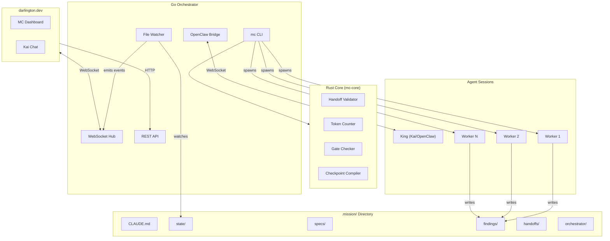
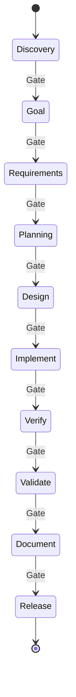

# Architecture

MissionControl is a multi-agent orchestration system where a **King** agent (Kai, via OpenClaw) coordinates **worker** agents through a **10-stage workflow**.

## System Overview



**Key insight:** The King is an OpenClaw agent (Kai) with a system prompt. The Go bridge spawns worker processes and relays events — no custom LLM API calls. Rust core handles deterministic operations (validation, token counting, checkpoint compilation) that shouldn't consume LLM tokens.

## Key Concepts

### King Agent (Kai)
The King is Kai, running as an OpenClaw agent. It orchestrates the workflow, spawns workers via `mc` CLI commands, approves stage gates, and communicates with the user. It never implements directly.

The orchestrator connects to Kai via the OpenClaw gateway WebSocket. Messages from the MC dashboard route through the bridge to Kai's session.

### Workers
Workers are ephemeral Claude Code sessions. They receive a **briefing** (~300 tokens), do their task, output **findings**, and die. This keeps context lean and costs low.

### Briefing Generation
`mc briefing generate <task-id>` auto-composes a worker briefing from task metadata and predecessor findings. It loads the task from `tasks.jsonl`, validates all dependencies are complete, reads their findings files from `.mission/findings/`, extracts the Summary header from each, and outputs a briefing JSON to `.mission/handoffs/<task-id>-briefing.json`. This replaces the previous fully-manual briefing authoring workflow.

### 10-Stage Workflow



Each stage has a **gate** with criteria that must be met before advancing.

| Stage | Purpose | Workers | Gate Criteria |
|-------|---------|---------|---------------|
| **Discovery** | Research feasibility & prior art | Researcher | Spec drafted, feasibility assessed |
| **Goal** | Define goals & success metrics | Analyst | Goals defined, metrics established |
| **Requirements** | Document requirements & acceptance criteria | Requirements Engineer | Requirements documented |
| **Planning** | API contracts, data models, system design | Architect | Architecture approved |
| **Design** | UI mockups, wireframes, user flows | Designer | Design artifacts approved |
| **Implement** | TDD loop: unit-tester writes failing tests, developer makes them pass | Unit-Tester, Developer | All unit tests pass, code compiles |
| **Verify** | Code review, quality checks, requirements satisfied | Reviewer | Code review complete, review issues addressed, requirements satisfied |
| **Validate** | E2E integration testing, real environment validation | Integration-Tester | E2E tests pass, real environment validated |
| **Document** | README + docs | Docs | Docs complete |
| **Release** | Deploy & verify | DevOps | Deployed, verified |

### Zones
Zones organize the codebase into bounded areas. Workers are assigned to zones and stay in their lane.

| Zone | Scope |
|------|-------|
| Frontend | UI components, styles, client logic |
| Backend | APIs, services, server logic |
| Database | Schemas, migrations, queries |
| Infra | CI/CD, deployment, monitoring |
| Shared | Cross-cutting utilities, types |

Zones support CRUD (create, edit, split, merge) and workers are assigned via `mc spawn <persona> <task> --zone <zone>`. This prevents workers from stepping on each other's files.

### Task Scope Paths
Tasks support a `scope_paths` field (`--scope-paths` flag on `mc task create`) listing specific files/directories a worker should touch. This provides finer-grained boundaries than zones — workers know exactly which files are in scope and stay within them.

### Task Dependencies
Tasks support `blocks`/`blockedBy` relationships with cycle detection. `mc ready` shows tasks with no open blockers.

### Gate Management

Gates control stage transitions. Each stage has a gate with named criteria stored in `.mission/state/gates.json`.

**Workflow:**
1. `mc gate status` — view criteria for the current stage (✓/✗ per criterion, progress count)
2. Workers or the King satisfy criteria as work completes: `mc gate satisfy "unit tests"` (substring match)
3. `mc gate satisfy --all` — bulk-satisfy all criteria (useful after manual verification)
4. `mc stage next` — checks `gates.json` first; if all criteria are met, advances automatically without `--force`

**Data flow:**
- `initGateForStage()` calls `mc-core check-gate <stage>` to get the canonical criteria list and writes it to `gates.json`
- `satisfyCriterion()` finds a criterion by substring match (exactly one must match; ambiguous or zero matches error)
- `allCriteriaMet()` is checked by `mc stage next` before allowing advancement
- If `gates.json` has no entry for the stage, falls back to `mc-core check-gate` for validation

**Legacy compatibility:** The loader auto-detects the old format (plain string arrays) and converts to the structured `{description, satisfied}` format on read.

### Checkpoints & Session Continuity
State snapshots saved at key moments (gate approvals, token thresholds, graceful shutdown). `mc checkpoint restart` compiles a ~500 token briefing and restarts the King session with full context preserved.

### Audit Trail
Append-only `audit/interactions.jsonl` logs all state mutations with actor, action, target, and timestamp.

### Git Auto-Commit
All mutations auto-commit with `[mc:{category}]` prefixed messages. Configurable per-category.

## Worker Tracking

The orchestrator tracks worker lifecycle through gateway events and a pre-registration pattern.

### Two-Step Registration (Register + Link)

Gateway lifecycle events don't carry task metadata (labels, personas, zones). Workers are registered in two steps:

1. **Register by label** — `POST /api/mc/worker/register {label, task_id, persona, zone, model}` stores metadata in a `labelRegistry` map keyed by label. No sessionKey needed yet.
2. **Link after spawn** — `POST /api/mc/worker/link {label, session_key}` binds the label to a sessionKey. Moves metadata from `labelRegistry` to `workerRegistry` (keyed by sessionKey) and builds a reverse index.

This eliminates the race condition where lifecycle events arrive before the operator knows the sessionKey.

The old combined endpoint (`POST /register` with `session_key` in the body) is preserved for backward compatibility.

### Bridge Lifecycle Event Flow

```text
Kai → POST /api/mc/worker/register {label, task_id, persona, zone, model}
Kai → sessions_spawn → gets sessionKey back
Kai → POST /api/mc/worker/link {label, session_key}
Gateway → agent event (stream: "lifecycle", phase: "start")
  → Handler looks up workerRegistry[sessionKey]
  → Maps runId → sessionKey
  → Calls tracker.Register(label, taskID, persona, zone, model)
  → Broadcasts hub topic "workers", type "worker_started"
  ... worker runs ...
Gateway → agent event (stream: "lifecycle", phase: "end")
  → Handler looks up runToSession[runId] → sessionKey
  → Calls tracker.Deregister(label, "complete")
  → Broadcasts hub topic "workers", type "worker_stopped"
  → Cleans up registry and runToSession maps
```

### Token Tracking

The handler parses token counts from subagent chat events using regex:
```
tokens (\d+\.?\d*)k \(in (\d+) / out (\d+)\)
```
On match, calls `tracker.UpdateTokens(workerID, totalTokens, costUSD)`. Token data is surfaced via `GET /api/mc/workers` in each worker's `token_count` field.

### Event Buffering (Race Condition Handling)

Fast workers can emit lifecycle events before the link HTTP request arrives. The handler buffers both start and end events:

- **`pendingStarts`** — Buffers `lifecycle/start` events for unregistered sessions. When `POST /link` arrives, any buffered start is replayed immediately.
- **`pendingEnds`** — Buffers `lifecycle/end` events when `runToSession` has no entry (start hasn't been processed yet). After a buffered start is processed, any matching buffered end is replayed immediately.
- **Expiry** — A cleanup goroutine sweeps both buffers every 30s, removing entries older than 60s.
- **Dedup** — A bounded set of 1000 `(runId, phase)` pairs prevents duplicate event processing.

### Tracker Register/Deregister

The `tracker.Tracker` supports two discovery modes:

1. **File-based polling** — Reads `workers.json` every 2s, detects new/changed/dead workers by PID.
2. **Programmatic registration** — `Register(workerID, taskID, persona, zone, model)` and `Deregister(workerID, status)` for gateway-based workers (PID=0). PID health checks are skipped for these.

Both modes fire the same `EventCallback` (`"spawned"`, `"status_changed"`, `"heartbeat"`).

### Hub Broadcast Topics

| Topic | Event Type | When |
|-------|-----------|------|
| `workers` | `worker_started` | lifecycle/start processed |
| `workers` | `worker_stopped` | lifecycle/end processed |

### REST Endpoints

| Endpoint | Method | Purpose |
|----------|--------|---------|
| `/api/mc/worker/register` | POST | Pre-register worker metadata before spawn |
| `/api/mc/workers` | GET | List active workers from tracker |

## Status Values

### Task Statuses
Tasks progress through: **pending** → **active** → **done**

### Gate Statuses
Gates progress through: **pending** → **approved**

> **Note:** `"complete"` is **not** a valid status. It appeared in legacy dead code and has been removed. The canonical terminal status for tasks is `"done"`.

## Stack

| Component | Language | Purpose |
|-----------|----------|---------|
| **mc CLI** | Go | CLI commands for all state operations |
| **Orchestrator** | Go | Process management, REST, WebSocket, OpenClaw bridge |
| **mc-core** | Rust | Validation, token counting, gate checking, checkpoint compilation |
| **Core** | Rust | Workflow engine, knowledge manager |
| **King** | OpenClaw (Kai) | Orchestration agent |
| **Workers** | Claude Code | Ephemeral task execution |
| **UI** | React (darlington.dev) | Dashboard on Vercel |

## Directory Structure

```text
/
├── cmd/mc/                  # mc CLI (Go)
├── orchestrator/            # Go orchestrator
│   ├── api/                 # REST endpoints
│   ├── bridge/              # OpenClaw WebSocket bridge
│   ├── core/                # Rust subprocess wrapper
│   ├── manager/             # Process management
│   └── ws/                  # WebSocket hub
├── core/                    # Rust core
│   ├── workflow/            # Stage engine, gates, tasks
│   ├── knowledge/           # Checkpoints, validation
│   ├── mc-protocol/         # Shared data structures
│   └── ffi/                 # FFI bindings
├── web/                     # React UI (legacy, now on darlington.dev)
├── agents/                  # Python agents (educational, v1)
├── docs/
│   └── archive/             # Historical specs
└── Makefile
```

## mc CLI

| Command | Purpose |
|---------|---------|
| `mc init` | Create .mission/ scaffold |
| `mc status` | JSON dump of state |
| `mc stage` / `mc stage next` | Get/advance current stage |
| `mc task create/list/update` | Task management |
| `mc dep add/remove/tree` | Task dependencies |
| `mc ready` | Tasks with no open blockers |
| `mc blocked` | Show blocked tasks |
| `mc spawn <persona> <task> [--zone <zone>]` | Spawn worker process |
| `mc kill <worker-id>` | Kill worker process |
| `mc workers` | List active workers |
| `mc handoff <file>` | Validate and store handoff |
| `mc gate check/approve <stage>` | Gate management |
| `mc gate satisfy <substring>` | Satisfy a gate criterion by substring match |
| `mc gate satisfy --all` | Satisfy all criteria for current stage |
| `mc gate status` | Show gate criteria status for current stage |
| `mc checkpoint` | Create checkpoint snapshot |
| `mc checkpoint restart` | Restart with compiled briefing |
| `mc checkpoint status` | Session health |
| `mc checkpoint history` | Past sessions |
| `mc checkpoint auto --tokens <n>` | Auto-checkpoint at threshold |
| `mc team` | Agent team management |
| `mc project link/list` | Project symlinks |
| `mc audit` | Query audit trail |
| `mc briefing generate <task-id>` | Auto-compose briefing from task metadata + predecessor findings |
| `mc migrate` | Convert v5 → v6 |
| `mc serve` | Start orchestrator |

## mc-core (Rust)

```bash
mc-core validate-handoff <file>      # Schema + semantic validation
mc-core check-gate <stage>           # Gate criteria evaluation
mc-core count-tokens <file>          # Token counting (tiktoken)
mc-core checkpoint-compile <file>    # Compile checkpoint → briefing
mc-core checkpoint-validate <file>   # Validate checkpoint schema
```

### Integrator Gate Check (Implement Stage)
When multiple tasks exist in the implement stage, the gate checker (`Gate::check_integrator_requirement`) requires at least one task with `persona == "integrator"` to be completed before the gate can pass. This ensures an integration verification step always runs when work is parallelized. Single-task implement stages skip this requirement.

### JSONL Compatibility Deserializer
The Rust core uses a lightweight `JsonlTask` struct to deserialize Go-written JSONL task lines, which use string representations for dates and status values. This avoids schema mismatches between the Go CLI (which writes tasks) and the Rust core (which reads them for gate checking). Lines that fail to parse are silently skipped, ensuring forward compatibility.

## .mission/ Directory

```text
.mission/
├── CLAUDE.md              # King system prompt
├── config.json            # Project settings, auto_commit config
├── state/
│   ├── stage.json         # Current workflow stage
│   ├── tasks.jsonl        # Tasks (one per line)
│   ├── workers.json       # Active worker processes
│   └── gates.json         # Gate approval status (10 gates)
├── audit/
│   └── interactions.jsonl # Mutation audit trail
├── specs/                 # Design documents, requirements
├── findings/              # Worker output
├── handoffs/              # Validated handoff JSONs
├── checkpoints/           # Checkpoint snapshots
├── orchestrator/
│   ├── checkpoints/       # Session checkpoints
│   ├── current.json       # Current session state
│   └── sessions.jsonl     # Session history
└── prompts/               # 11 persona prompts
```

## Worker Personas

| Persona | Stage | Model Tier | Purpose |
|---------|-------|-----------|---------|
| **King (Kai)** | All | Opus | Strategy, user conversation |
| Researcher | Discovery | Sonnet | Feasibility, prior art |
| Analyst | Goal | Sonnet | Goals, metrics, scope |
| Requirements Engineer | Requirements | Sonnet | Requirements & criteria |
| Architect | Planning | Sonnet | API contracts, system design |
| Designer | Design | Sonnet | UI mockups, wireframes |
| Unit-Tester | Implement | Sonnet | Write failing tests (TDD red phase) |
| Developer | Implement | Sonnet | Make tests pass (TDD green phase) |
| Reviewer | Verify | Sonnet | Code review, quality, requirements |
| Integration-Tester | Validate | Sonnet | E2E tests, Playwright, real service testing |
| QA | Validate | Haiku | E2E validation |
| Docs | Document | Haiku | Documentation |
| DevOps | Release | Haiku | Deployment |

## Design Rationale

**Why King + Workers?** King maintains continuity; workers are disposable with lean context. Handoffs are cheap: spawn fresh vs accumulate.

**Why Rust Core?** Deterministic logic shouldn't use LLM tokens. Token counting and validation need to be fast and strict.

**Why 10 Stages?** Prevents rushing to implementation. Gates force quality at each transition. Separates research, goals, requirements, and planning into dedicated phases.

**Why JSONL?** Git merges line-by-line. Concurrent writes don't conflict. Append-only audit trail.

**Why File-Based State?** Agents read/write files naturally. No complex IPC. Easy to inspect, debug, and checkpoint.

**Why OpenClaw?** Kai (the King) runs as a persistent OpenClaw agent with memory, tools, and multi-channel communication. No tmux lifecycle management needed.
