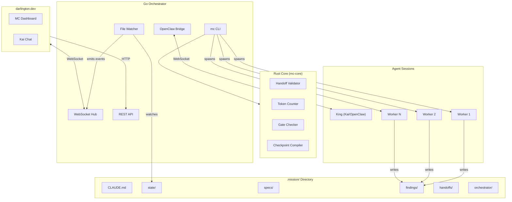
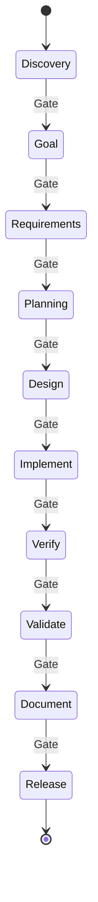

# Architecture

MissionControl is a multi-agent orchestration system where a **King** agent (Kai, via OpenClaw) coordinates **worker** agents through a **10-stage workflow**.

## System Overview



**Key insight:** The King is an OpenClaw agent (Kai) with a system prompt. The Go bridge spawns worker processes and relays events — no custom LLM API calls. Rust core handles deterministic operations (validation, token counting, checkpoint compilation) that shouldn't consume LLM tokens.

## Key Concepts

### King Agent (Kai)
The King is Kai, running as an OpenClaw agent. It orchestrates the workflow, spawns workers via `mc` CLI commands, approves stage gates, and communicates with the user. It never implements directly.

The orchestrator connects to Kai via the OpenClaw gateway WebSocket. Messages from the MC dashboard route through the bridge to Kai's session.

### Workers
Workers are ephemeral Claude Code sessions. They receive a **briefing** (~300 tokens), do their task, output **findings**, and die. This keeps context lean and costs low.

### 10-Stage Workflow



Each stage has a **gate** with criteria that must be met before advancing.

| Stage | Purpose | Workers | Gate Criteria |
|-------|---------|---------|---------------|
| **Discovery** | Research feasibility & prior art | Researcher | Spec drafted, feasibility assessed |
| **Goal** | Define goals & success metrics | Analyst | Goals defined, metrics established |
| **Requirements** | Document requirements & acceptance criteria | Requirements Engineer | Requirements documented |
| **Planning** | API contracts, data models, system design | Architect | Architecture approved |
| **Design** | UI mockups, wireframes, user flows | Designer | Design artifacts approved |
| **Implement** | Build features | Developer, Debugger | Code complete, builds |
| **Verify** | Code review & quality checks | Reviewer, Security, Tester | All checks pass |
| **Validate** | E2E validation, user acceptance | QA | User flows validated |
| **Document** | README + docs | Docs | Docs complete |
| **Release** | Deploy & verify | DevOps | Deployed, verified |

### Task Dependencies
Tasks support `blocks`/`blockedBy` relationships with cycle detection. `mc ready` shows tasks with no open blockers.

### Checkpoints & Session Continuity
State snapshots saved at key moments (gate approvals, token thresholds, graceful shutdown). `mc checkpoint restart` compiles a ~500 token briefing and restarts the King session with full context preserved.

### Audit Trail
Append-only `audit/interactions.jsonl` logs all state mutations with actor, action, target, and timestamp.

### Git Auto-Commit
All mutations auto-commit with `[mc:{category}]` prefixed messages. Configurable per-category.

## Stack

| Component | Language | Purpose |
|-----------|----------|---------|
| **mc CLI** | Go | CLI commands for all state operations |
| **Orchestrator** | Go | Process management, REST, WebSocket, OpenClaw bridge |
| **mc-core** | Rust | Validation, token counting, gate checking, checkpoint compilation |
| **Core** | Rust | Workflow engine, knowledge manager |
| **King** | OpenClaw (Kai) | Orchestration agent |
| **Workers** | Claude Code | Ephemeral task execution |
| **UI** | React (darlington.dev) | Dashboard on Vercel |

## Directory Structure

```
/
├── cmd/mc/                  # mc CLI (Go)
├── orchestrator/            # Go orchestrator
│   ├── api/                 # REST endpoints
│   ├── bridge/              # OpenClaw WebSocket bridge
│   ├── core/                # Rust subprocess wrapper
│   ├── manager/             # Process management
│   └── ws/                  # WebSocket hub
├── core/                    # Rust core
│   ├── workflow/            # Stage engine, gates, tasks
│   ├── knowledge/           # Checkpoints, validation
│   ├── mc-protocol/         # Shared data structures
│   └── ffi/                 # FFI bindings
├── web/                     # React UI (legacy, now on darlington.dev)
├── agents/                  # Python agents (educational, v1)
├── docs/
│   └── archive/             # Historical specs
└── Makefile
```

## mc CLI

| Command | Purpose |
|---------|---------|
| `mc init` | Create .mission/ scaffold |
| `mc status` | JSON dump of state |
| `mc stage` / `mc stage next` | Get/advance current stage |
| `mc task create/list/update` | Task management |
| `mc dep add/remove/tree` | Task dependencies |
| `mc ready` | Tasks with no open blockers |
| `mc blocked` | Show blocked tasks |
| `mc spawn <persona> <task>` | Spawn worker process |
| `mc kill <worker-id>` | Kill worker process |
| `mc workers` | List active workers |
| `mc handoff <file>` | Validate and store handoff |
| `mc gate check/approve <stage>` | Gate management |
| `mc checkpoint` | Create checkpoint snapshot |
| `mc checkpoint restart` | Restart with compiled briefing |
| `mc checkpoint status` | Session health |
| `mc checkpoint history` | Past sessions |
| `mc checkpoint auto --tokens <n>` | Auto-checkpoint at threshold |
| `mc team` | Agent team management |
| `mc project link/list` | Project symlinks |
| `mc audit` | Query audit trail |
| `mc migrate` | Convert v5 → v6 |
| `mc serve` | Start orchestrator |

## mc-core (Rust)

```bash
mc-core validate-handoff <file>      # Schema + semantic validation
mc-core check-gate <stage>           # Gate criteria evaluation
mc-core count-tokens <file>          # Token counting (tiktoken)
mc-core checkpoint-compile <file>    # Compile checkpoint → briefing
mc-core checkpoint-validate <file>   # Validate checkpoint schema
```

## .mission/ Directory

```
.mission/
├── CLAUDE.md              # King system prompt
├── config.json            # Project settings, auto_commit config
├── state/
│   ├── stage.json         # Current workflow stage
│   ├── tasks.jsonl        # Tasks (one per line)
│   ├── workers.json       # Active worker processes
│   └── gates.json         # Gate approval status (10 gates)
├── audit/
│   └── interactions.jsonl # Mutation audit trail
├── specs/                 # Design documents, requirements
├── findings/              # Worker output
├── handoffs/              # Validated handoff JSONs
├── checkpoints/           # Checkpoint snapshots
├── orchestrator/
│   ├── checkpoints/       # Session checkpoints
│   ├── current.json       # Current session state
│   └── sessions.jsonl     # Session history
└── prompts/               # 11 persona prompts
```

## Worker Personas

| Persona | Stage | Model Tier | Purpose |
|---------|-------|-----------|---------|
| **King (Kai)** | All | Opus | Strategy, user conversation |
| Researcher | Discovery | Sonnet | Feasibility, prior art |
| Analyst | Goal | Sonnet | Goals, metrics, scope |
| Requirements Engineer | Requirements | Sonnet | Requirements & criteria |
| Architect | Planning | Sonnet | API contracts, system design |
| Designer | Design | Sonnet | UI mockups, wireframes |
| Developer | Implement | Sonnet | Build features |
| Debugger | Implement | Sonnet | Fix issues |
| Reviewer | Verify | Haiku | Code review |
| Security | Verify | Sonnet | Vulnerability analysis |
| Tester | Verify | Haiku | Write tests |
| QA | Validate | Haiku | E2E validation |
| Docs | Document | Haiku | Documentation |
| DevOps | Release | Haiku | Deployment |

## Design Rationale

**Why King + Workers?** King maintains continuity; workers are disposable with lean context. Handoffs are cheap: spawn fresh vs accumulate.

**Why Rust Core?** Deterministic logic shouldn't use LLM tokens. Token counting and validation need to be fast and strict.

**Why 10 Stages?** Prevents rushing to implementation. Gates force quality at each transition. Separates research, goals, requirements, and planning into dedicated phases.

**Why JSONL?** Git merges line-by-line. Concurrent writes don't conflict. Append-only audit trail.

**Why File-Based State?** Agents read/write files naturally. No complex IPC. Easy to inspect, debug, and checkpoint.

**Why OpenClaw?** Kai (the King) runs as a persistent OpenClaw agent with memory, tools, and multi-channel communication. No tmux lifecycle management needed.
