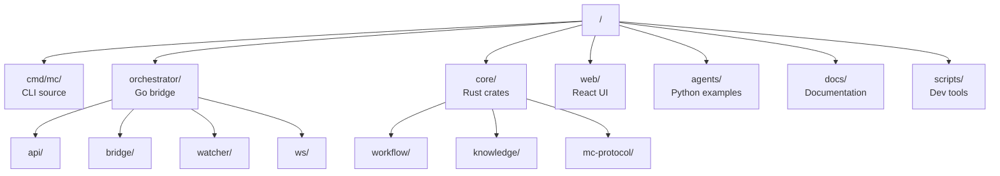
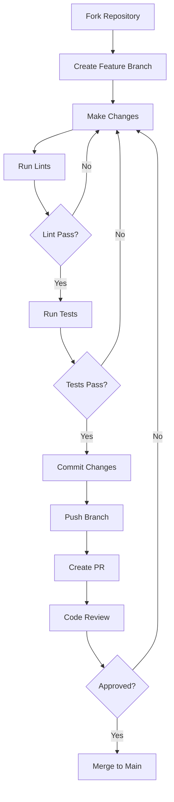
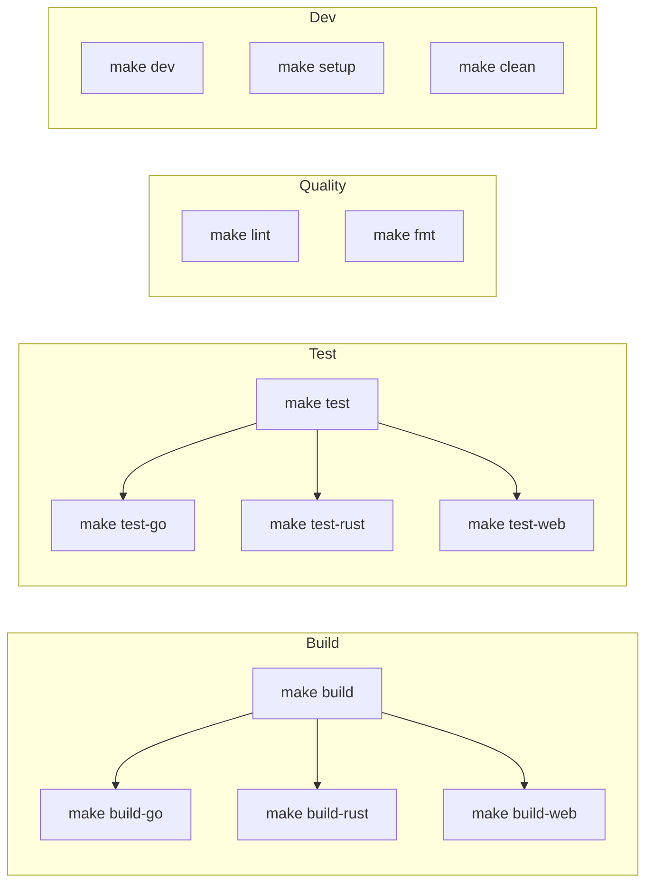
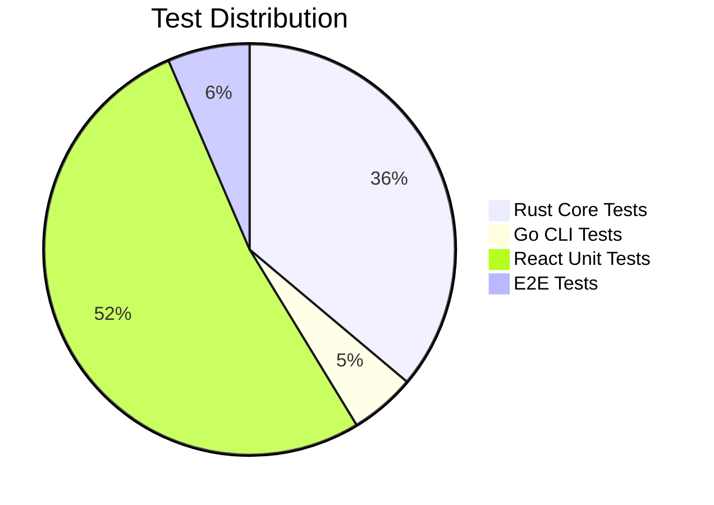
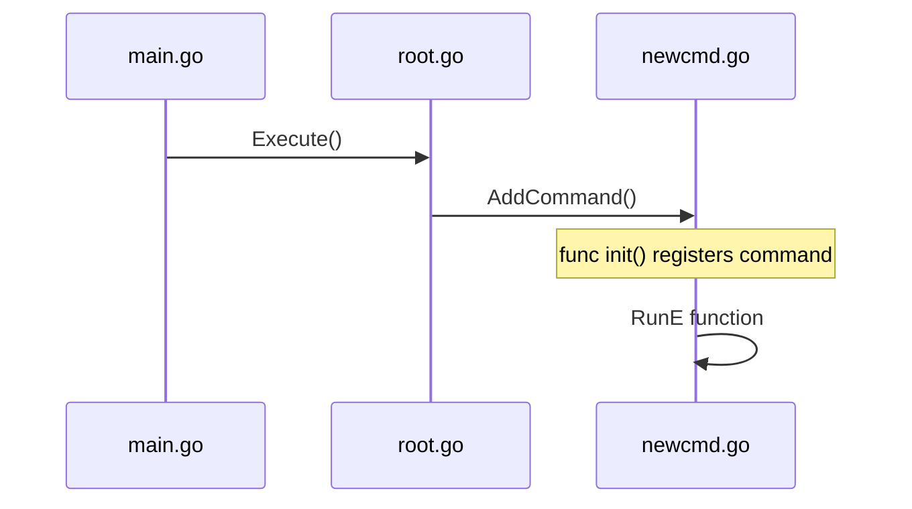
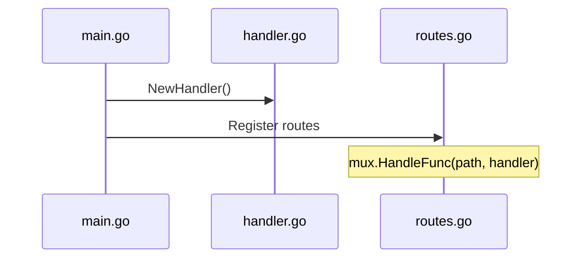
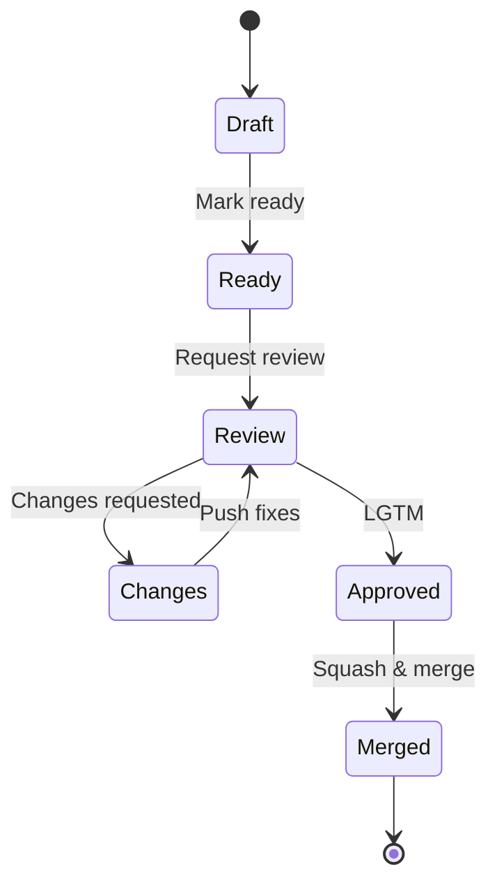
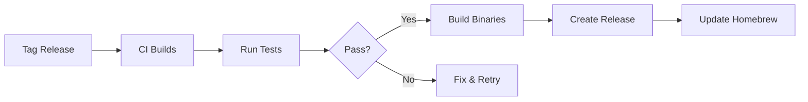

# Contributing to MissionControl

## Development Setup

### Prerequisites

- Go 1.21+
- Rust 1.70+
- Node.js 18+
- Claude Code CLI

### Quick Start

```bash
# Clone repository
git clone https://github.com/yourname/mission-control
cd mission-control

# Enable pre-commit hooks (formatting + vet)
git config core.hooksPath .githooks

# Install dependencies
make setup

# Build everything
make build

# Run tests
make test

# Start development
make dev
```

## Project Structure



## Development Workflow



## Build System

### Makefile Targets



## Code Style

### Go

- Use `gofmt` and `golangci-lint`
- Follow standard Go project layout
- Error handling: wrap errors with context

```bash
make lint-go
make fmt-go
```

### Rust

- Use `rustfmt` and `clippy`
- Prefer `Result` over `panic!`
- Document public APIs

```bash
make lint-rust
make fmt-rust
```

### TypeScript/React

- Use ESLint and Prettier
- Functional components with hooks
- Zustand for state management

```bash
make lint-web
make fmt-web
```

## Testing Strategy



### Unit Tests

```bash
# All tests
make test

# Specific component
make test-go
make test-rust
make test-web
```

### E2E Tests

```bash
# Start services
make dev

# Run Playwright tests
cd web && npm run test:e2e
```

## Component Development

### Adding a new mc CLI command



1. Create `cmd/mc/newcmd.go`
2. Define command with `cobra.Command`
3. Register in `init()` with `rootCmd.AddCommand()`
4. Add tests in `cmd/mc/mc_test.go`

### Adding a new API endpoint



1. Add handler in `orchestrator/api/`
2. Register route in `main.go`
3. Add WebSocket event if needed
4. Update TypeScript types in `web/src/types/`

### Adding a new React component

1. Create component in `web/src/components/`
2. Add to relevant store if stateful
3. Write tests in `*.test.tsx`
4. Add to Storybook if applicable

## Commit Convention

```
type(scope): description

[optional body]

[optional footer]
```

Types:
- `feat`: New feature
- `fix`: Bug fix
- `docs`: Documentation
- `refactor`: Code change (no feature/fix)
- `test`: Adding tests
- `chore`: Maintenance

Examples:
```
feat(cli): add mc checkpoint command
fix(watcher): handle missing state directory
docs(readme): update architecture diagram
```

## Pull Request Process



1. Create feature branch from `main`
2. Make changes with tests
3. Ensure CI passes (`make lint && make test`)
4. Create PR with description
5. Address review feedback
6. Squash and merge when approved

## Release Process



## Architecture Decisions

When making significant changes, document the decision:

1. Create ADR in `docs/adr/`
2. Use template: Context, Decision, Consequences
3. Reference in relevant code comments

## Getting Help

- Check existing issues
- Join Discord (link TBD)
- Ask in discussions

## License

MIT License - see [LICENSE](./LICENSE)