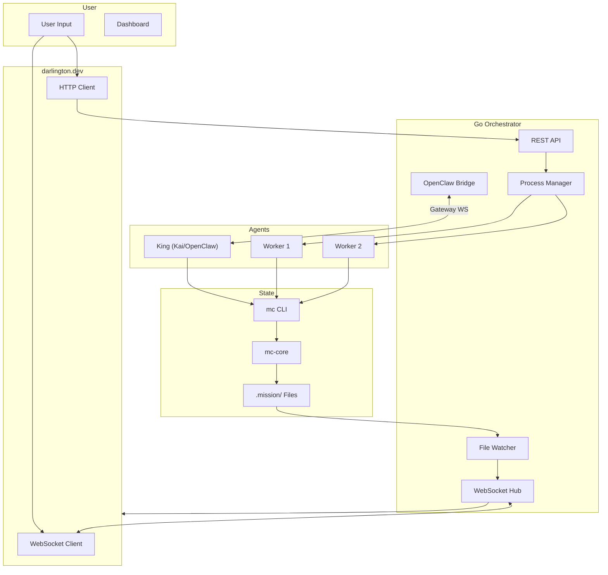
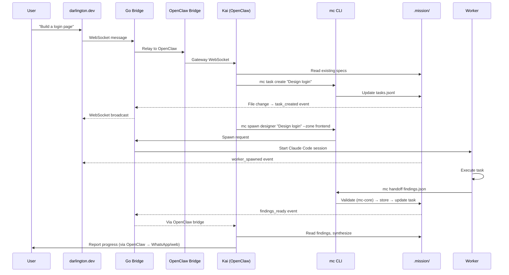
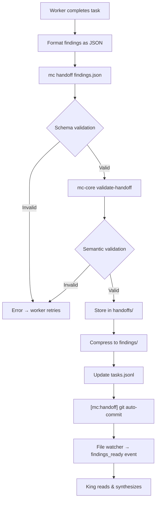
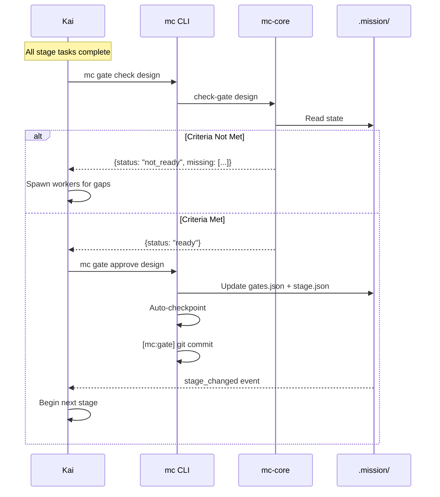
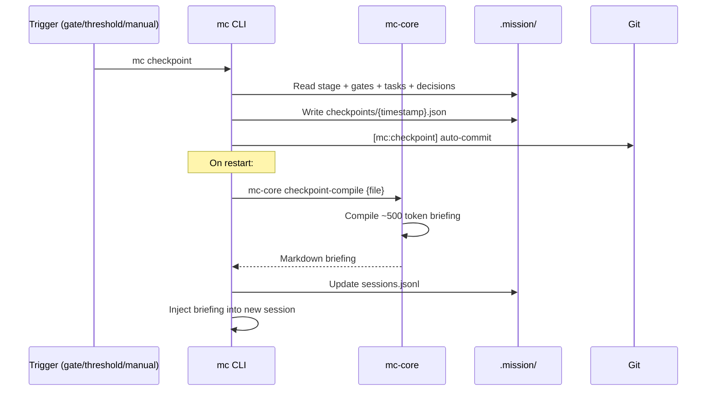

# Data Flows

## Core Data Flow

## User Request Flow

## Worker Handoff Flow

## Gate Approval Flow

## Checkpoint Flow

## WebSocket Events

| Event | Source | Description |
|-------|--------|-------------|
| `mission_state` | Connect | Initial state sync |
| `stage_changed` | Gate approval | Stage transitioned |
| `task_created` | mc task create | New task |
| `task_updated` | mc task update | Status changed |
| `gate_ready` | File watcher | Gate criteria met |
| `gate_approved` | mc gate approve | Gate approved |
| `worker_spawned` | mc spawn | Worker started |
| `worker_completed` | Handoff | Worker finished |
| `worker_errored` | Process crash | Worker failed |
| `findings_ready` | Handoff stored | New findings |
| `checkpoint_created` | Auto/manual | State snapshot |
| `session_restarted` | Restart | New session with briefing |

## State Synchronization

The file watcher polls `.mission/state/` every 500ms, computes deltas, and broadcasts events through the WebSocket hub. All connected clients (darlington.dev dashboard, other tools) receive real-time updates.

## Error Handling

- **Validation errors**: mc-core returns structured errors, worker retries or fails
- **Process crashes**: Go bridge detects, emits `worker_errored`, King decides to retry or mark failed
- **Network disconnects**: WebSocket auto-reconnect with backoff, full state resync on connect
- **Gateway disconnects**: OpenClaw bridge auto-reconnects to Kai's gateway
