# Data Flows

This document details the data flows within MissionControl.

## Core Data Flow Overview

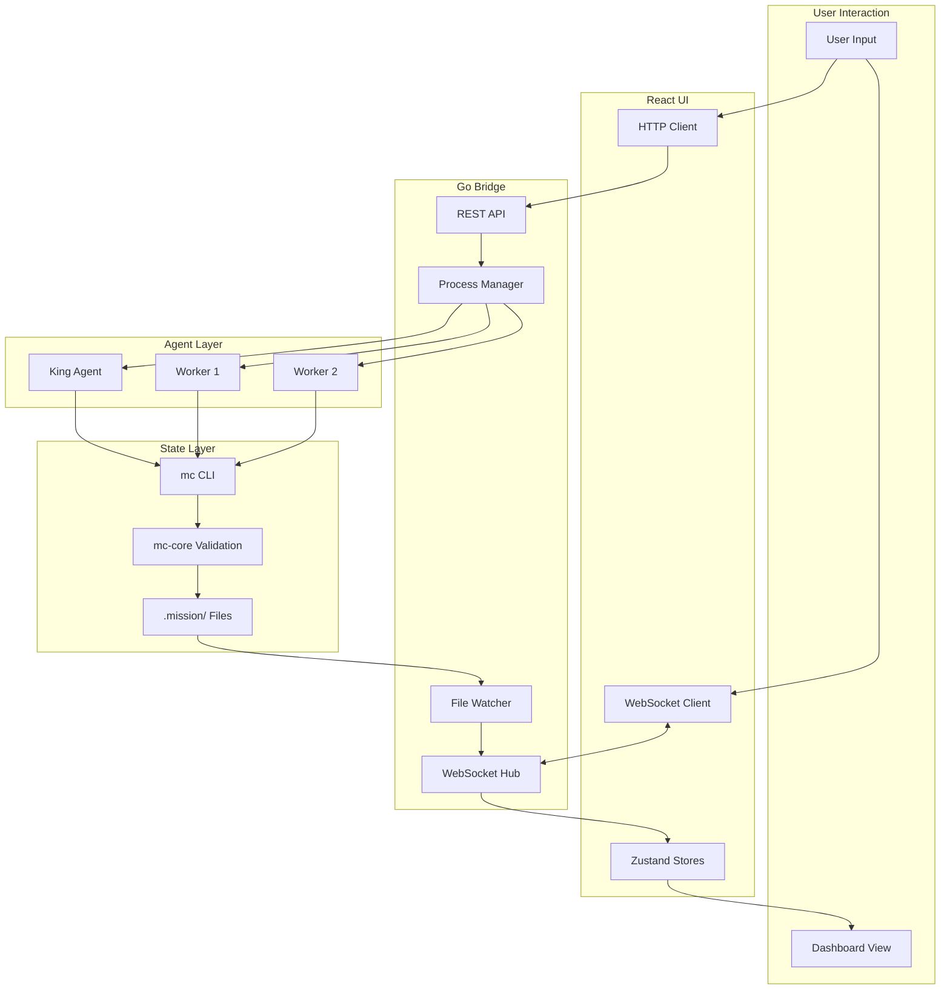

## User Request Flow (King Mode)

When a user sends a request to King:

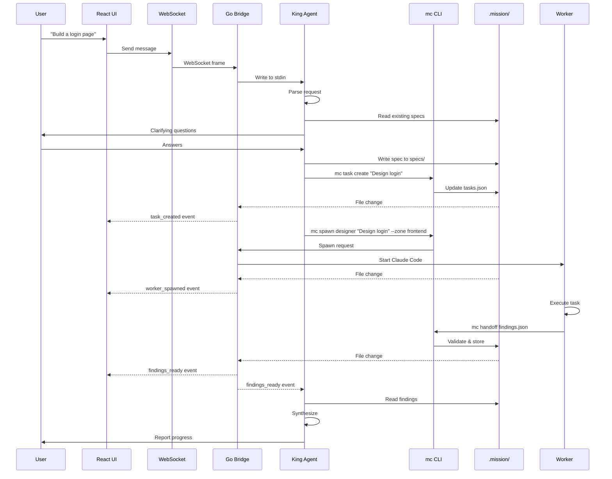

## Worker Handoff Flow

Detailed flow when a worker completes a task:

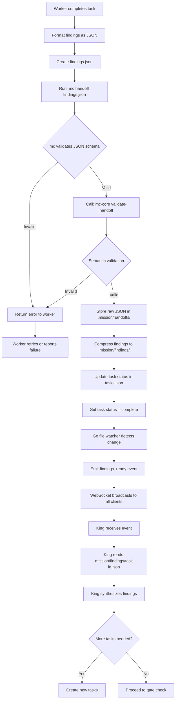

## Gate Approval Flow

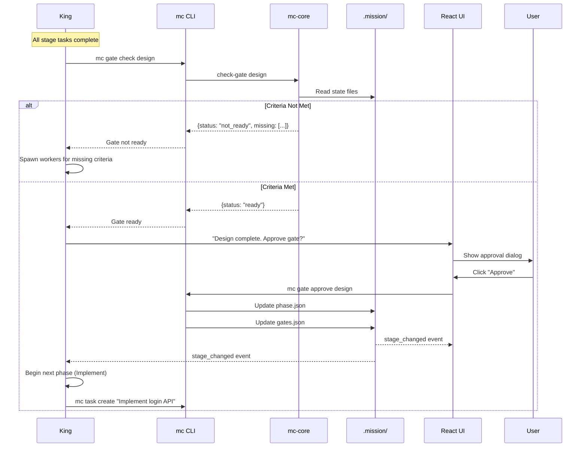

## WebSocket Event Flow

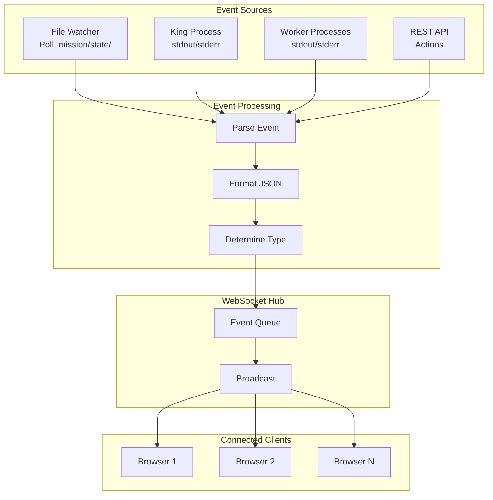

### Event Types

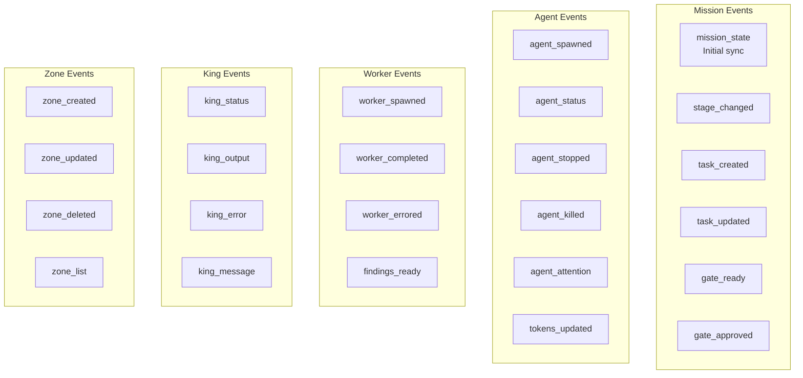

## State Synchronization

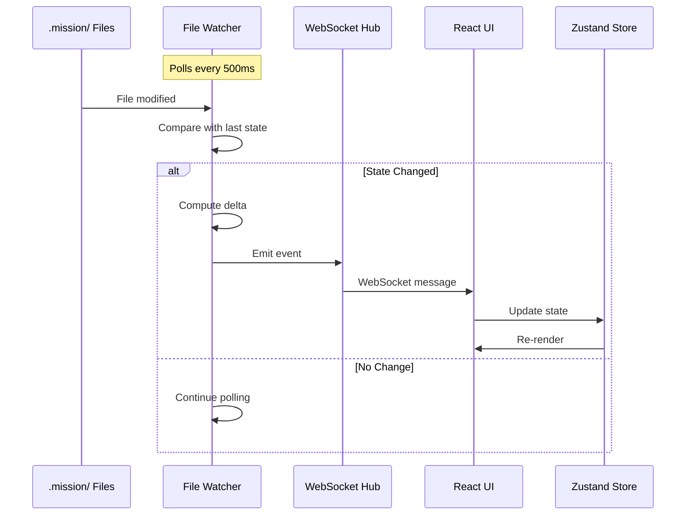

## Token Budget Flow

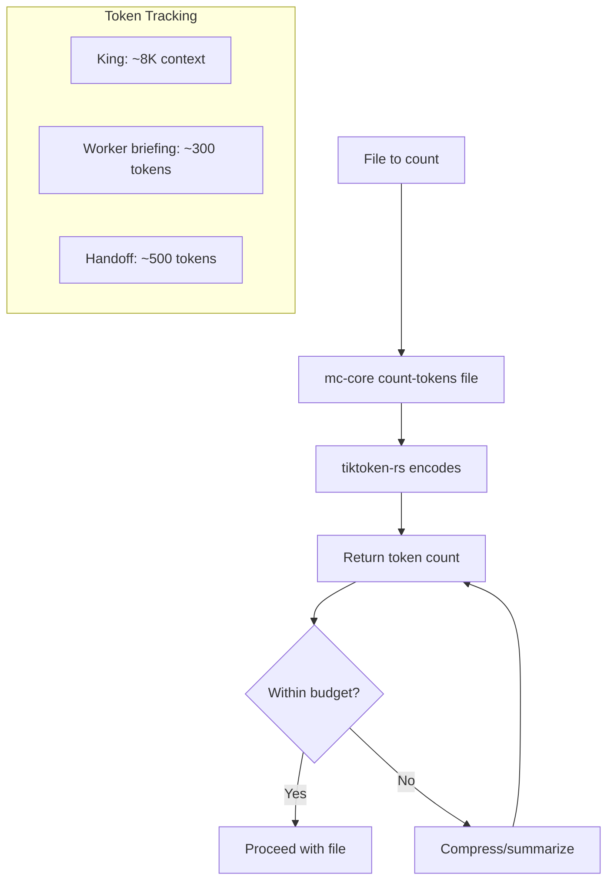

## Checkpoint/Recovery Flow

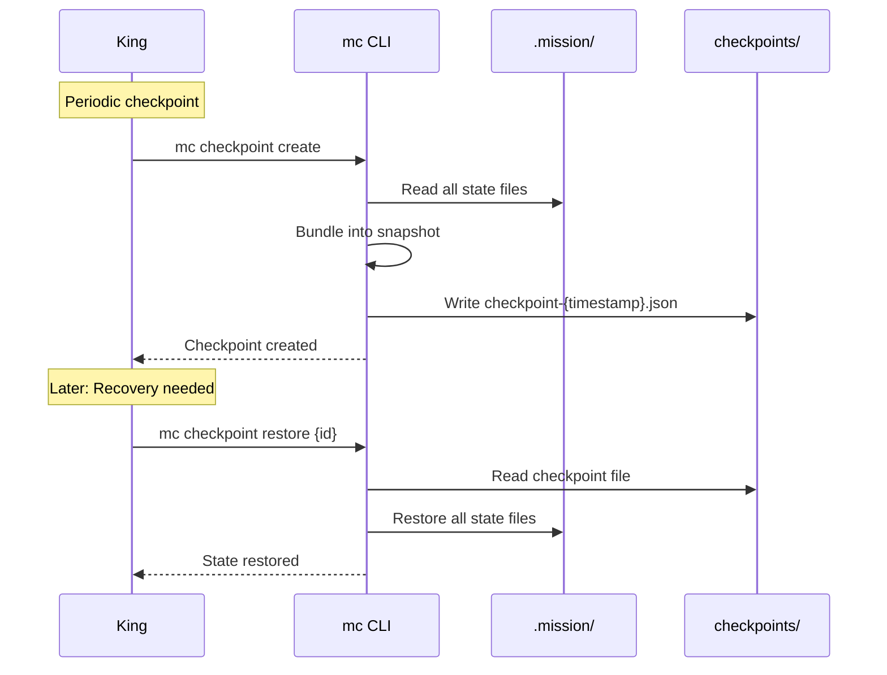

## Multi-Zone Data Flow

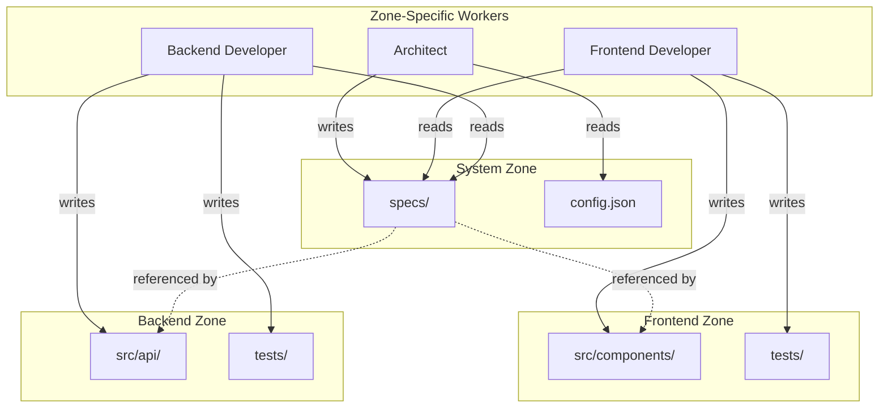

## Error Handling Flow

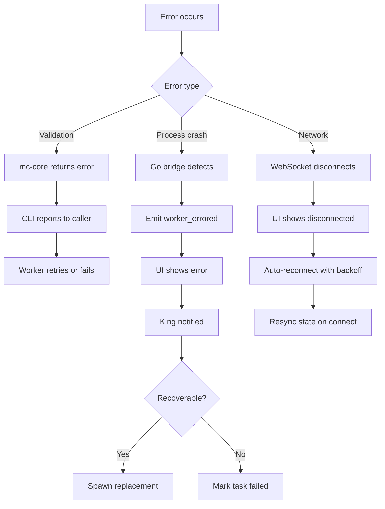