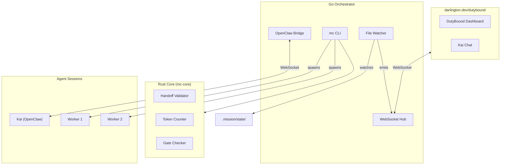

# DutyBound

**Provenance-driven agentic project orchestration.**

AI agents that are *bound by duty* to follow process. DutyBound enforces a 10-stage gated workflow where every commit traces back to a task, every task traces back to a stage, and no agent can skip the rules — not even the orchestrator.

Built on **MissionControl** (`mc`), a CLI and process engine that coordinates an orchestrating agent (**Kai**) and ephemeral worker agents through gated stages. Context lives in files, not conversation memory.

## Why DutyBound?

AI agents can write code fast. But "fast" doesn't mean "auditable." In enterprise contexts, you need to know *who* decided *what*, *when*, and *why* — and you need proof that process was followed, not just promises.

DutyBound makes AI development auditable by default:

- Every commit links to a task via provenance trailers (`MC-Task`, `MC-Persona`, `MC-Stage`)
- Every task belongs to a stage with gate criteria that must be satisfied before advancing
- A trusted CI validator (built from `main`) checks that PRs follow the rules — the PR can't ship a tampered validator that approves itself
- The orchestrating agent (Kai) cannot bypass gates — only humans can `--force`

## Architecture



**Key insight:** Kai is an OpenClaw agent with a system prompt — not a custom LLM integration. The Go orchestrator spawns worker processes and relays events. Rust handles deterministic operations (validation, token counting, gate checking) that shouldn't consume LLM tokens.

## 10-Stage Workflow

```
Discovery → Goal → Requirements → Planning → Design → Implement → Verify → Validate → Document → Release
```

Each transition is gated. Gates have named criteria that must be satisfied before the workflow advances. Gates can auto-advance when all criteria pass, or require explicit approval.

| Stage | Purpose | Workers |
|-------|---------|---------|
| **Discovery** | Research feasibility & prior art | Researcher |
| **Goal** | Define goals & success metrics | Analyst |
| **Requirements** | Document requirements & acceptance criteria | Requirements Engineer |
| **Planning** | API contracts, data models, system design | Architect |
| **Design** | UI mockups, wireframes, user flows | Designer |
| **Implement** | TDD: tester writes failing tests, developer makes them pass | Tester, Developer |
| **Verify** | Code review, security review, quality checks | Reviewer, Security |
| **Validate** | E2E integration testing in real environment | Integration Tester |
| **Document** | README, API docs, architecture docs | Docs |
| **Release** | Deploy & verify | DevOps |

## Process Enforcement

DutyBound enforces its own workflow — it's not optional guidance, it's code-enforced rules.

**Provenance trailers** — `mc commit --task <id>` appends `MC-Task`, `MC-Persona`, and `MC-Stage` to the commit message. Every commit traces back to a mission task.

**Scope-path enforcement** — tasks declare which files they're allowed to touch. Commits that modify out-of-scope files are rejected.

**Mandatory task binding** — `mc commit` requires `--task <id>`. No unattributed commits. Infrastructure changes use `--no-task --reason <reason>`.

**Trusted CI validator** — GitHub Actions builds `mc` from `main` and validates the PR with it. The PR can't tamper with its own validator.

**Stage enforcement** — code-enforced checks block rushing: zero-task detection, velocity checks (<10s stages), mandatory reviewer in verify, mandatory integrator when parallelizing.

**Strict validation:**
```bash
mc commit --validate-only --strict
```

## How It Works

### Kai (the Orchestrator)
Kai is the only persistent agent. It talks to the user, decides what to build, creates tasks, spawns workers, and manages stage transitions. It never implements directly.

### Workers
Workers are ephemeral. They receive a briefing (~300 tokens), do their task, write findings, and terminate. This keeps context lean and costs low. Briefings auto-compose from task metadata and predecessor findings.

### State
All state lives in `.mission/` — JSONL task files, gate status, audit logs, findings, checkpoints. File-based state means agents read/write naturally, git diffs are clean, and everything is inspectable.

### Audit Trail
Append-only `audit/interactions.jsonl` logs every state mutation with actor, action, target, and timestamp. Combined with provenance trailers, this gives you full traceability from business requirement to deployed commit.

## Stack

| Component | Language | Purpose |
|-----------|----------|---------|
| **mc CLI** | Go | All state operations — tasks, stages, gates, commits, workers |
| **Orchestrator** | Go | Process management, REST API, WebSocket hub, OpenClaw bridge |
| **mc-core** | Rust | Validation, token counting, gate checking |
| **Kai** | OpenClaw | Orchestrating agent |
| **Workers** | Claude Code | Ephemeral task execution |
| **Dashboard** | React | Real-time dashboard on darlington.dev |

## Installation

```bash
git clone https://github.com/DarlingtonDeveloper/MissionControl.git
cd MissionControl
make build
make install
```

**Prerequisites:** Go 1.22+, Rust (stable), Make

## Quick Start

```bash
# Initialize a project
cd /path/to/your/project
mc init

# Check status
mc status

# Create a task
mc task create "Build login form" --stage implement --persona developer --scope-paths "src/auth/"

# Manage dependencies
mc ready              # Tasks with no open blockers
mc dep tree <id>      # Dependency graph
mc blocked            # All blocked tasks

# Gate management
mc gate status        # Show criteria for current stage
mc gate satisfy "unit tests"  # Satisfy a criterion
mc stage next         # Advance (auto-checks gate)

# Workers
mc spawn --persona developer --task <id>
mc workers
mc kill <worker-id>

# Commits with provenance
mc commit --task <id> -m "Implement login form"

# Checkpoints
mc checkpoint         # Snapshot current state
mc checkpoint restart # Resume with compiled briefing

# Audit
mc audit              # View mutation history
```

### Start the Orchestrator

```bash
cd orchestrator
go run . --workdir /path/to/project
# REST API on localhost:8080
```

## Development

```bash
make build    # Build all (Go + Rust)
make test     # Run all tests
make lint     # golangci-lint + clippy
make fmt      # Format all code
```

## Project Structure

```
cmd/mc/           Go CLI — all mc commands
orchestrator/     Go orchestrator — bridge, API, WebSocket, process management
core/             Rust core — validation, token counting, gate checking
web/              React dashboard (deployed to darlington.dev)
agents/           Python agents (v1, educational)
docs/             Specs and historical documentation
```

## Version History

| Version | Description |
|---------|-------------|
| v6 | 10-stage workflow, JSONL storage, task dependencies, OpenClaw bridge, process purity enforcement |
| v5 | King orchestration + mc CLI |
| v4 | Rust core (workflow engine, validation, token counting) |
| v3 | React dashboard |
| v2 | Go orchestrator |
| v1 | Python agent fundamentals |

## Documentation

- [ARCHITECTURE.md](./ARCHITECTURE.md) — detailed system documentation
- [CHANGELOG.md](./CHANGELOG.md) — version history with details
- [CONTRIBUTING.md](./CONTRIBUTING.md) — contribution guidelines

## Naming

- **DutyBound** — the product (repo, README, website)
- **MissionControl (mc)** — the process engine (CLI, code, `.mission/` directories)
- **Kai** — the orchestrating agent

Inspired by [Vibecraft](https://vibecraft.dev), [Ralv](https://ralv.dev), and [Gastown](https://gastown.dev).
