# MissionControl

A multi-agent orchestration system where a **King** agent coordinates **worker** agents through a **10-stage workflow**. Workers spawn, complete tasks, and die. Context lives in files, not conversation memory.

Inspired by [Vibecraft](https://vibecraft.dev), [Ralv](https://ralv.dev), and [Gastown](https://gastown.dev).

## Architecture


**Key insight:** The King is an OpenClaw agent (Kai) with a good system prompt. The Go bridge spawns worker processes and relays events — no custom LLM API calls.

## 10-Stage Workflow

```mermaid
stateDiagram-v2
    direction LR
    [*] --> Discovery
    Discovery --> Goal : ✓ Gate
    Goal --> Requirements : ✓ Gate
    Requirements --> Planning : ✓ Gate
    Planning --> Design : ✓ Gate
    Design --> Implement : ✓ Gate
    Implement --> Verify : ✓ Gate
    Verify --> Validate : ✓ Gate
    Validate --> Document : ✓ Gate
    Document --> Release : ✓ Gate
    Release --> [*]
```



Each stage has a **gate** with criteria that must be met before advancing. Gates can auto-advance when all criteria are satisfied, or be manually approved by the King.

## Key Concepts

### King Agent
The King is the only persistent agent. It orchestrates the workflow, decides what to build, spawns workers, and approves stage gates. It never implements directly.

### Workers
Workers are ephemeral. They receive a **briefing** (~300 tokens), do their task, output **findings**, and die. This keeps context lean and costs low.

### Agent Teams
Workers can be organized into teams with shared context and coordinated task assignment.

### Task Dependencies
Tasks support `blocks`/`blockedBy` relationships with cycle detection. `mc ready` shows tasks with no open blockers.

### Checkpoints
State snapshots saved at key moments (stage transitions, before compaction). Supports manual and auto-checkpoint on gate approvals.

### Audit Trail
Append-only `audit/interactions.jsonl` logs all state mutations with actor, action, target, and timestamp.

### Git Auto-Commit
All state mutations (tasks, gates, checkpoints, workers, handoffs) automatically commit to git with descriptive messages. Configurable per-category via `.mission/config.json`.

## Status

| Version | Status | Description |
|---------|--------|-------------|
| v1 | ✅ Done | Python agent fundamentals |
| v2 | ✅ Done | Go orchestrator + Rust parser |
| v3 | ✅ Done | Full 2D dashboard (81 tests) |
| v4 | ✅ Done | Rust core (workflow, knowledge, health) |
| v5 | ✅ Done | King orchestration + mc CLI |
| v6 | ✅ Done | 10-stage workflow, JSONL, dependencies, OpenClaw bridge |
| v7 | 📋 Planned | Requirements & traceability |
| v8 | 📋 Planned | Infrastructure & scale |

## Stack

| Component | Language | Purpose |
|-----------|----------|---------|
| **mc CLI** | Go | MissionControl CLI commands |
| **Orchestrator** | Go | Process management, REST, WebSocket, OpenClaw bridge |
| **mc-core** | Rust | Validation, token counting, gate checking |
| **King** | OpenClaw (Kai) | Orchestration agent |
| **Workers** | Claude Code | Task execution |
| **UI** | React (darlington.dev) | Dashboard on Vercel |

## Installation

### From Source

```bash
git clone https://github.com/DarlingtonDeveloper/MissionControl.git
cd MissionControl
make build
make install
```

## Quick Start

```bash
# Initialize a project
cd /path/to/your/project
mc init

# Check status
mc status

# Create a task
mc task create "Build login form" --stage implement --zone frontend --persona developer

# Check dependencies
mc ready              # Tasks with no open blockers
mc dep tree <id>      # Dependency graph
mc blocked            # All blocked tasks

# Gate management
mc gate check discovery
mc gate approve discovery

# Checkpoints
mc checkpoint         # Manual checkpoint
mc checkpoint list    # List all checkpoints

# Workers
mc spawn --persona developer --task <id>
mc workers
mc kill <worker-id>

# Audit
mc audit              # View mutation history
```

### Orchestrator

```bash
cd orchestrator
go run . --workdir /path/to/project

# REST API on localhost:8080
curl localhost:8080/api/mission/status
curl -X POST localhost:8080/api/mission/gates/discovery/approve
```

## v6 Features

- **10-Stage Workflow** — Discovery → Goal → Requirements → Planning → Design → Implement → Verify → Validate → Document → Release
- **JSONL Storage** — Line-based task storage for clean git diffs and concurrent writes
- **Hash-Based Task IDs** — Deterministic `mc-xxxxx` IDs from SHA256(title + timestamp)
- **Task Dependencies** — `blocks`/`blockedBy` with cycle detection, ready queue, dependency visualization
- **Agent Teams** — Organize workers into coordinated teams
- **Project Symlinks** — Global registry for quick project switching
- **OpenClaw WebSocket Bridge** — Native integration with OpenClaw gateway
- **Message Relay** — Bridge relays messages between orchestrator and OpenClaw
- **Auto-Checkpoint** — Automatic state snapshots on gate approvals
- **Git Auto-Commit** — All mutations auto-committed with `[mc:{category}]` prefix
- **Audit Trail** — Append-only interaction log
- **CI Pipeline** — GitHub Actions (build, test, vet, golangci-lint), pre-commit hooks

## Process Enforcement

MissionControl enforces its own workflow via `--strict` validation:

```bash
mc commit --validate-only --strict
```

**What `--strict` checks:**
- **Verify persona coverage** — verify stage must have `done` tasks for `reviewer`, `security`, and `tester` personas
- **Integrator requirement** — implement stages with multiple tasks require at least one `integrator` persona task to be done

**CI Pipeline (`mc-validate`):**
- Runs on all PRs to `main` via GitHub Actions
- Builds `mc` + `mc-core` using `make build-ci` (lightweight, no web assets)
- Executes `mc commit --validate-only --strict` to enforce process gates
- PRs that violate workflow rules cannot merge

**Trusted Validator (Phase 2):**
- CI builds from `main` produce a trusted `mc` binary (two-step: build on main → validate on PR)
- Prevents PRs from shipping a tampered validator that approves itself
- OpenClaw agent config enforces per-persona tool policies (e.g. reviewers can't write code, developers can't approve gates)

## Development

```bash
make build    # Build all components
make test     # Run tests
make dev      # Start dev environment
```

See [ARCHITECTURE.md](./ARCHITECTURE.md) for detailed system documentation.
See [FUTURETODO.md](./FUTURETODO.md) for the roadmap.
