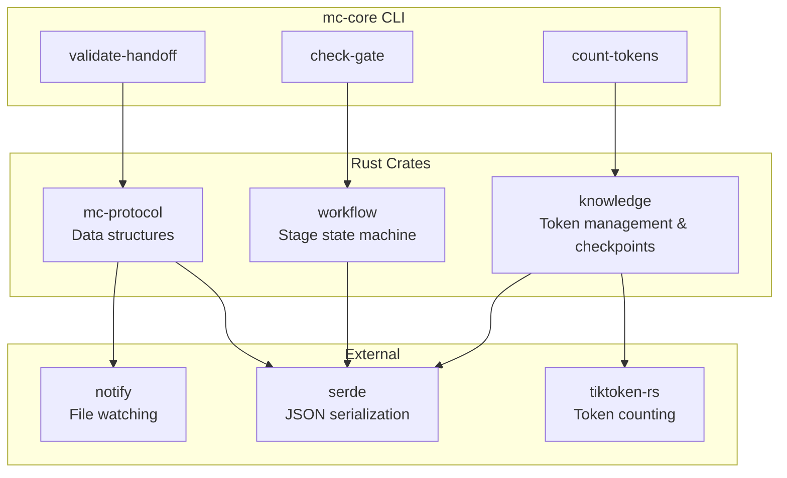
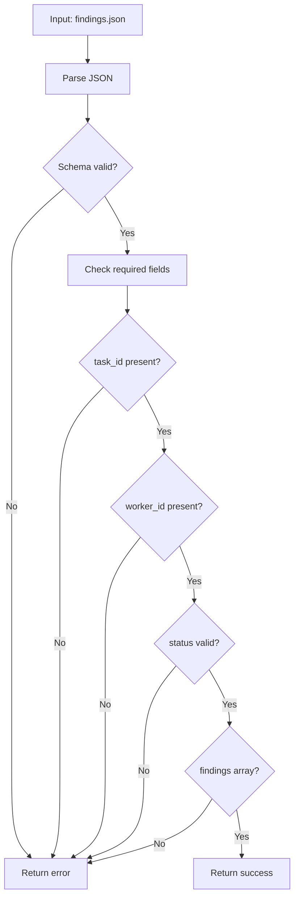
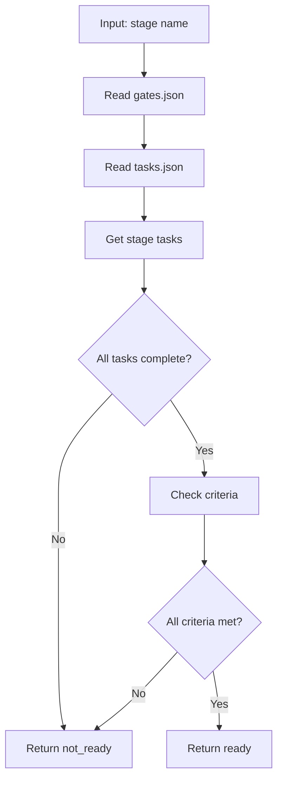
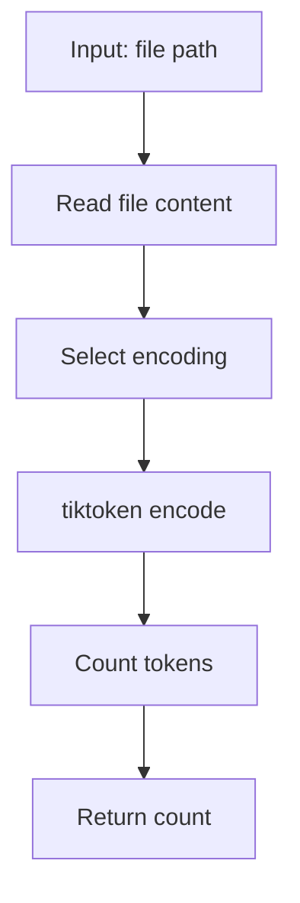
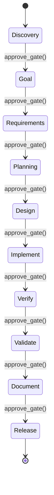
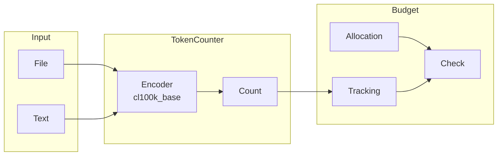
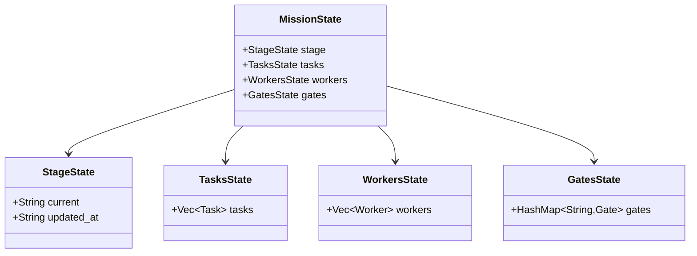
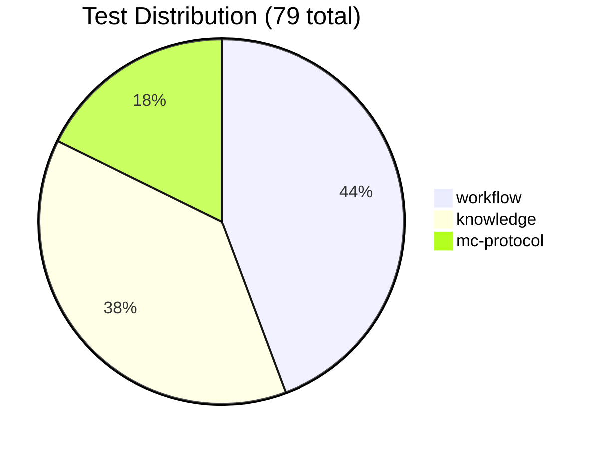
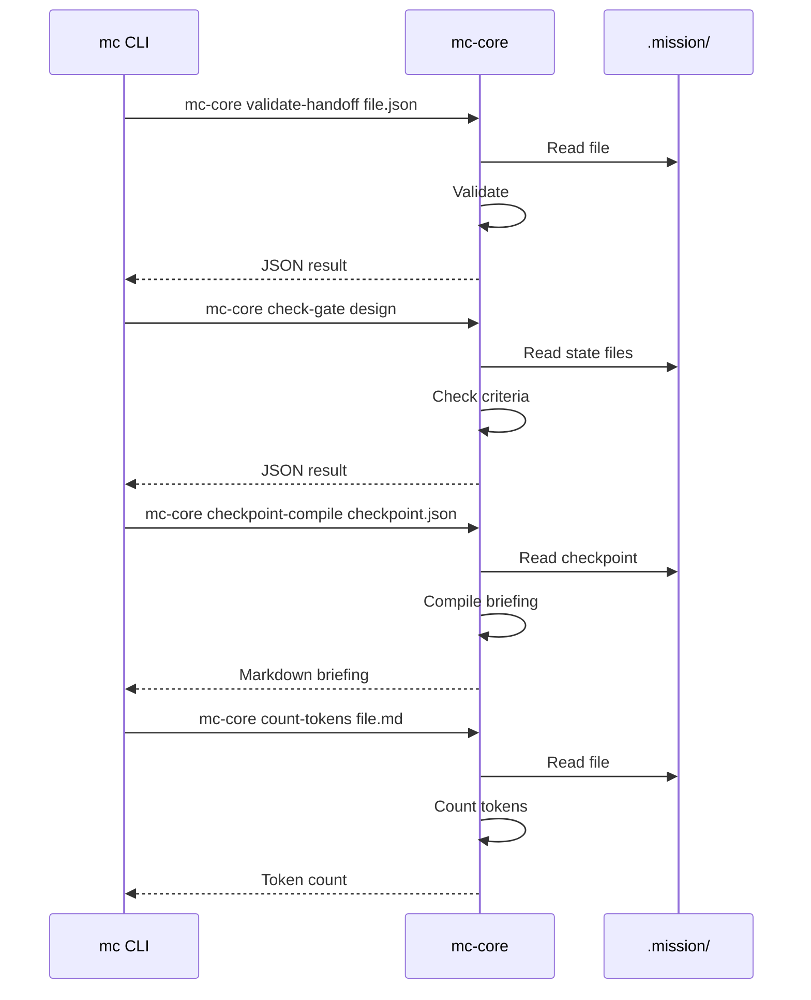

# MissionControl Core (Rust)

Rust crates providing deterministic logic for MissionControl.

## Overview



## Crate Structure

```
core/
├── workflow/       # Stage state machine, gates, tasks
├── knowledge/      # Token counting, budgets, handoffs, checkpoints
├── mc-protocol/    # Shared data structures
├── mc-core/        # CLI binary
├── ffi/            # C-compatible FFI bindings
└── Cargo.toml      # Workspace manifest
```

## mc-core CLI

The `mc-core` binary exposes core functionality to the Go layer:

```bash
# Validate a handoff JSON file
mc-core validate-handoff findings.json

# Check if gate criteria are met
mc-core check-gate design

# Count tokens in a file
mc-core count-tokens spec.md

# Compile checkpoint into markdown briefing
mc-core checkpoint-compile checkpoint.json

# Validate checkpoint JSON schema
mc-core checkpoint-validate checkpoint.json
```

### validate-handoff



### check-gate



### count-tokens



## workflow Crate

Stage state machine and task management.



### Key Types

```rust
pub enum Stage {
    Discovery,
    Goal,
    Requirements,
    Planning,
    Design,
    Implement,
    Verify,
    Validate,
    Document,
    Release,
}

pub enum TaskStatus {
    Pending,
    Ready,
    InProgress,
    Blocked,
    Done,
}

pub struct Task {
    pub id: String,
    pub description: String,
    pub stage: Stage,
    pub status: TaskStatus,
    pub zone: String,
    pub dependencies: Vec<String>,
}

pub struct Gate {
    pub stage: Stage,
    pub status: GateStatus,
    pub criteria: Vec<GateCriterion>,
}

pub struct WorkflowEngine {
    current_stage: Stage,
    tasks: HashMap<String, Task>,
    gates: HashMap<String, Gate>,
}
```

### API

```rust
impl WorkflowEngine {
    pub fn current_stage(&self) -> Stage;
    pub fn can_transition(&self, to: Stage) -> bool;
    pub fn transition(&mut self, to: Stage) -> Result<()>;

    pub fn create_task(&mut self, task: Task) -> Result<String>;
    pub fn update_task_status(&mut self, id: &str, status: TaskStatus) -> Result<()>;
    pub fn get_ready_tasks(&self) -> Vec<&Task>;

    pub fn check_gate(&self, stage: Stage) -> GateCheckResult;
    pub fn approve_gate(&mut self, stage: Stage) -> Result<()>;
}
```

## knowledge Crate

Token counting and budget management.



### Key Types

```rust
pub struct TokenCounter {
    encoding: Encoding,
}

pub struct TokenBudget {
    pub king_context: usize,      // ~8000
    pub worker_briefing: usize,   // ~300
    pub handoff_output: usize,    // ~500
}

pub struct Handoff {
    pub task_id: String,
    pub worker_id: String,
    pub status: String,
    pub findings: Vec<Finding>,
    pub artifacts: Vec<String>,
    pub open_questions: Vec<String>,
}

pub struct Finding {
    pub finding_type: String,
    pub summary: String,
}
```

### API

```rust
impl TokenCounter {
    pub fn count(&self, text: &str) -> usize;
    pub fn count_file(&self, path: &Path) -> Result<usize>;
}

impl TokenBudget {
    pub fn check(&self, usage: &TokenUsage) -> BudgetStatus;
    pub fn remaining(&self, component: Component) -> usize;
}
```

## mc-protocol Crate

Shared data structures and file watching.



### File Watcher

```rust
pub fn watch_task(
    task_id: &str,
    mission_dir: &str,
    timeout: Duration,
) -> Result<WatchResult>;

pub enum WatchResult {
    Complete { response_path: String },
    Timeout,
}
```

## Building

```bash
# Build all crates
cargo build --release

# Run tests
cargo test

# Run clippy
cargo clippy

# Format code
cargo fmt
```

## Testing



```bash
# All tests
cargo test

# Specific crate
cargo test -p workflow
cargo test -p knowledge
cargo test -p mc-protocol

# With output
cargo test -- --nocapture
```

## Integration with Go

The Go `mc` CLI calls `mc-core` as a subprocess:



## Error Handling

All errors are returned as JSON for easy parsing:

```json
{
  "error": true,
  "message": "Missing required field: task_id",
  "code": "VALIDATION_ERROR"
}
```

```rust
pub enum CoreError {
    ValidationError(String),
    FileNotFound(PathBuf),
    ParseError(String),
    StateError(String),
}
```

## Performance

Token counting benchmarks:

| File Size | Time |
|-----------|------|
| 1 KB | < 1ms |
| 10 KB | ~2ms |
| 100 KB | ~15ms |
| 1 MB | ~150ms |

The tiktoken-rs library provides fast BPE encoding compatible with Claude's tokenizer.